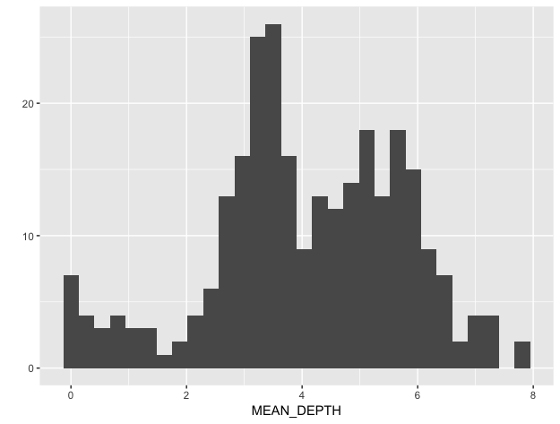
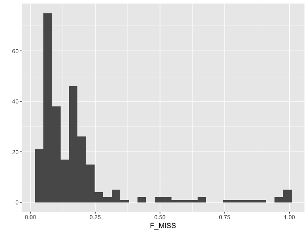
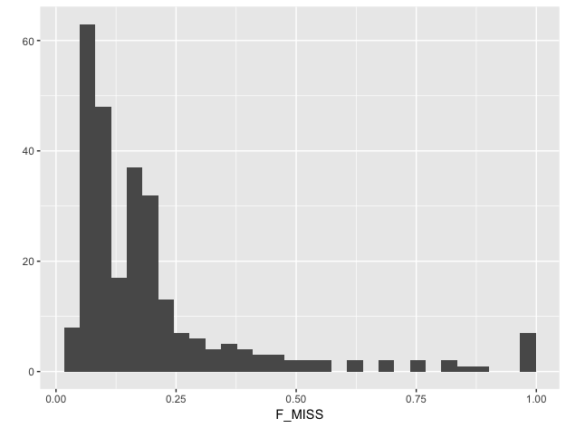
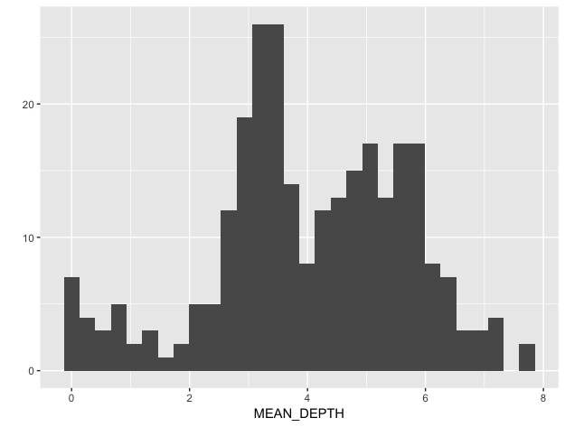
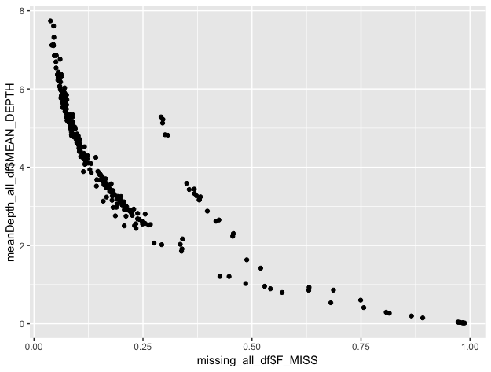
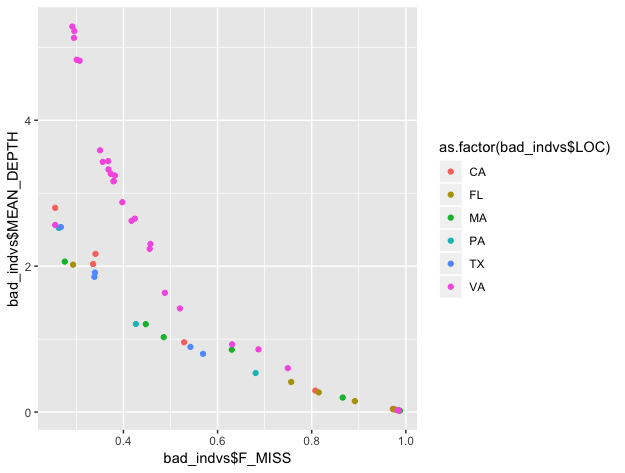

# NovaSeq Analysis Pipeline - Variant Calling

###### created by Jamilla Akhund-Zade

[TOC]


## So you have sequencing data...now what?

##### Download sequence data to local computer - *if you can! This is a 100+GB folder*

Make a directory on your local computer and go into it

```
mkdir NovaSeq
cd NovaSeq
```

Download your data with `wget`:

```
wget -r -nH --cut-dirs=1 --no-parent -e robots=off  --no-check-certificate --reject="index.htm*" https://data.rc.fas.harvard.edu/ngsdata/190809_A00794_0068_AHFFLJDRXX
```

##### *Better option:* Copy files to debivort_lab directory with your folder - lab has 4TB space!

Log in to Research Computing using JAuth.jar for two-factor authentication

```
ssh jakhundzade@login.rc.fas.harvard.edu
cd /n/debivort_lab/
mkdir Jamilla_seq
cd /n/debivort_lab/Jamilla_seq/
```

Get the data via `rsync`:

`rsync -va /n/boslfs/LABS/informatics/sequencing/PUBLISHED/190809_A00794_0068_AHFFLJDRXX`


## Next, you want to align your reads to a reference genome

#### Index your genome to prepare for alignment

##### Download latest genome release from FlyBase

I am using dmel-all-chromosome-r6.28.fasta. You can also download the annotation file dmel-all-r6.28.gff. 

##### Make genome folder and genome index in home directory on Odyssey

```
ssh jakhundzade@login.rc.fas.harvard.edu
mkdir Seq-Data
cd Seq-Data
mkdir 00_genome
cd Seq-Data/00_genome
```

##### Load bwa software for alignment and indexing

`module load bwa`

##### Index the genome

`bwa index -p dmel_r6 dmel-all-chromosome-r6.28.fasta`

#### Let's do a sample alignment with a single fly

If you like, you can make an Jupyter Lab interactive session to try all this in here: https://vdi.rc.fas.harvard.edu/pun/sys/dashboard/batch_connect/sessions

You should log in via VPN to vpn.rc.fas.harvard.edu with your Odyssey account and JAuth two-factor authentication to get access to this site.

##### Make folders to hold sample .fastq and .bam files

*note on .fastq file naming for this dataset:*

> [SAMPLE_NAME]\_[UNIQ_FLYID]\_[SAMPLESHEET_INDEX]\_[LANE]\_[READ]\_001.fastq.gz

```
cd Seq-Data/
mkdir 02_testBams
mkdir 01_testFastqs
```

Make path to lab directory holding the seq data

`LABDIR='/n/debivort_lab/Jamilla_seq/190809_A00794_0068_AHFFLJDRXX/Wild_Fly_Genetic_Diversity/'`

Copy over all BERK_1 .fastq files (4 flies x 2 lanes x 2 reads = 16 files)

`cp $LABDIR/BERK_1_* Seq-Data/01_testFastqs/`

##### Run 1-sample alignment in home directory on Odyssey

The `Seq-Data` folder should have a script called `sample_aligner.sh`. You can view this script in an editor, but its main function is to align reads from a single sample (.fastq.gz) (specified under FILE_NAME) in the script to the reference genome using a BWA MEM alignment algorithm and output a .sam file. 

You can change the FILE_NAME if you would like to align a different sample file. You can also change read-group (@RG) information, like the flowcell. LANE and SAMPLE are automatically parsed from the FILE_NAME. 

To run the script from the command line:

`./sample_aligner.sh`

You should see output from the BWA MEM alignment algorithm as it crunches through all your reads. You have now aligned sample data from *one lane*.

##### You need to download picard.jar file and put it in your home directory

RC no longer has Picard Tools as a module which sucks, so this is what you have to do to process your .sam file. You can find it here: https://github.com/broadinstitute/picard/releases/download/2.20.6/picard.jar

##### Sort and index your SAM file and convert it to a BAM file

Run this script from the command line:

`./sample_sam2bam.sh`

You will need at least 8GB RAM to do this and I used two cores in my interactive session. If you see that your process was 'killed' - you need to request more RAM. 

##### Collect summary alignment statistics

Check whether your alignment went OK - not necessary, but a good sanity check. See this [link](https://software.broadinstitute.org/gatk/documentation/tooldocs/4.0.7.0/picard_analysis_CollectAlignmentSummaryMetrics.php) for information on the fields. 

Run this script from the command line:

`./sample_bamAlignmentMetrics.sh`

View your alignment metrics file with 

`less -S SAMPLE.alignment.metrics.txt`

##### Repeat the alignment and BAM conversion steps for the *second lane* of sample data

Your sample file was BERK_1_1217_S218\_**L001**\_R1_001.fastq.gz. This is fly BERK_1_1217_S218 on Lane 1. Now you need to do all the above steps to the same fly on Lane 2: BERK_1_1217_S218\_**L002**\_R1_001.fastq.gz. You will have to change the FILE_NAME variable in `sample_aligner.sh` and change `${FILES[0]}` in the suite of "sample_bam" shell scripts to `${FILES[1]}` to reference the sample from the 2nd lane. 

This is to prepare for merging the two lane files together and doing de-duplication i.e. removing duplicate sequences from the same DNA fragment. 

##### Merge the lanes BAMs together

Run the following to generate the merged BAM and its index (.bai):

`./sample_bamMerge.sh`

Job parameters: 3GB of RAM and 2 min to run.  

##### Get rid of PCR and optical duplicates from the merged BAM

Run the following to create the final BAM with its corresponding index:

`./sample_bamDedup.sh`

Job parameters: ~3GB RAM, 4 min for deduplication; 1GB and 3 min for re-sorting.

##### Validate your final BAM file

Run the following:

`./sample_bamValidate.sh`

Job parameters: ~3GB RAM, 1 min


## Now you are ready to submit a job array to SLURM

##### Switch out the interactive session and log into RC

`ssh jakhundzade@login.rc.fas.harvard.edu`

Switch into your folder on scratchlfs (or make one if you haven't already)

`cd /n/scratchlfs/debivort_lab/Jamilla` 

Make directories in scratch and copy files into them

```
mkdir 00_genome
cp ~/Seq-Data/00_genome/* 00_genome
mkdir 01_fastqs
rsync -va  /n/debivort_lab/Jamilla_seq/190809_A00794_0068_AHFFLJDRXX/Wild_Fly_Genetic_Diversity/ 01_fastqs
mkdir 02_bams
```

Make a `tmp` folder to hold the standard error (`.err`) and standard out (`.out`) text files. Should clear it before running a new batch job array otherwise it will be full of files. Standard error and standard out are simply what is printed on the console in terms of errors and outs. You can check these files to see if any errors happened during your script run. 

You can check the FairShare score for you/lab using `sshare -U`. The higher it is, the more prioritized your jobs will be! 

##### Submit the alignment job array to SLURM

*N.B. You can no longer export arrays (make arrays available for child processes) in bash 4.1 - this means that you can't grab all the fastq files from a command in Terminal and export that array to each batch job you run. You will have to grab the list of fastq files within each batch job.*

Get the number of unique files in the 01_fastqs directory and zero-index them

```
FILES=($(ls -1 /n/scratchlfs/debivort_lab/Jamilla/01_fastqs | sed 's/_R.*//' | uniq))
NUMFASTQ=${#FILES[@]}
ZBNUMFASTQ=$(($NUMFASTQ - 1))
```

Make sure `echo $ZBNUMFASTQ` gives the number of unique sample/lane combos - 1. _There are 1092 .fastq files (273 samples x 2 lanes x 2 reads) from NovaSeq and you are submitting 546 jobs (273 samples x 2 lanes)._

Submit the job array from `Jamilla` directory:

`sbatch --array=0-$ZBNUMFASTQ ~/Seq-Data/bwa_aligner.sbatch`

You should get the message: `Submitted batch job [INSERT_JOB_ID_HERE]`. You are now aligning the reads, making a BAM file, and collecting alignment metrics (in that order) for each sample. 

_2:28pm 2019-09-03: Submitted batch job 21452608, alignment of all 273 samples_ 

_2:39pm 2019-09-03: batch job 21452608 canceled due to some fastq files not being read in_

_2:49pm 2019-09-03: Submitted batch job 21454553, alignment of 273 samples_

Monitor job progress with `squeue -l`. You can start by submitting smaller job arrays - like 4 or 5 - to get the hang of the system. To do that, just replace `$ZBNUMFASTQ` with the number you want e.g.  `sbatch --array=0-3 bwa_aligner.sbatch`. 


##### Debug failed alignments

Alignment failure in the above script can come from either BWA MEM failing to output a SAM file or the SAM file failing to be converted to a BAM file. You want to find those files that were not converted to a SAM file (failed in the first portion) and those files that did not turn into BAM files (failed in the second portion). 

For those files where BWA MEM failed, re-run the alignment separately and check where the error came from. No handy guide available - usually errors here have been a failure to read in the FASTQs so make sure those are being specified correctly. 

For those files where SAM to BAM conversion failed, you can run ValidateSamFile from Picard and look at the output. [Here is a guide for troubleshooting](https://gatkforums.broadinstitute.org/gatk/discussion/7571/errors-in-sam-bam-files-can-be-diagnosed-with-validatesamfile). 

 Consult `~/Seq-Data/bam_Debugging.sh` for more detail on the code.

 

**OPTION 1:**

You can try re-running the alignment the failed files to see whether the second round of alignment will fix the issues. To do this, you need to find those samples that failed and pull out their fastqs and copy them to a new directory. 

```
mkdir /n/scratchlfs/debivort_lab/Jamilla/01_fastqs/failed_samples
ls -1 /n/scratchlfs/debivort_lab/Jamilla/01_fastqs > fastq_raw_file_list.txt
grep -f allsam_files.txt test.txt | sed 's/[0-9]$/L00&/' | grep -f - fastq_raw_file_list.txt > fastqs_to_rerun.txt
cd 01_fastqs
xargs --arg-file=../02_bams/fastqs_to_rerun.txt cp --target-directory=/n/scratchlfs/debivort_lab/Jamilla/01_fastqs/failed_samples
```

Resubmit the batch job with just these files:

```
FILES=($(ls -1 /n/scratchlfs/debivort_lab/Jamilla/01_fastqs/failed_samples | sed 's/_R.*//' | uniq))
NUMFASTQ=${#FILES[@]}
ZBNUMFASTQ=$(($NUMFASTQ - 1))
sbatch --array=0-$ZBNUMFASTQ ~/Seq-Data/bwa_aligner_rerun.sbatch
```

_Persistent errors for MA_8_F3_1045_S46_1 SAM > BAM conversion. From here on try to debug this file by hand..._

**THE ERROR HAS BEEN FOUND 9/10/2019: ** Apparently there are empty reads in several fastq files that get propagated into the SAM file and then cause hell - now the goal is to find those fastq files, filter out all reads that are empty, and redo the SAM/BAM file making! Ideally this will take care of most of the issues. Use Trimmomatic (download the jar file) to filter out the empty reads. 

```
FILES=($(ls -1 /n/scratchlfs/debivort_lab/Jamilla/01_fastqs/failed_samples | sed 's/_R.*//' | uniq))
NUMFASTQ=${#FILES[@]}
ZBNUMFASTQ=$(($NUMFASTQ - 1))
sbatch --array=0-$ZBNUMFASTQ ~/Seq-Data/bwa_aligner_rerun.sbatch
```

_4:03pm 2019-09-11: Submitted batch job 22799419 on shared partition_

`sacct -j 22799419 --format JobID,Elapsed,ReqMem,MaxRSS,AllocCPUs,TotalCPU,State` to check on the job

##### Submit the BAM merging job array to SLURM

Create new directory in 02_bams called merged_bams

`mkdir 02_bams/merged_bams`


Get the number of unique BAM files:

```
FILES=($(cd /n/scratchlfs/debivort_lab/Jamilla/02_bams/ ; ls -1 *.bam | sed 's/_[12]_sorted.bam//' | uniq))
NUMFASTQ=${#FILES[@]}
ZBNUMFASTQ=$(($NUMFASTQ - 1))
```

Make sure `echo $ZBNUMFASTQ` gives the number of unique samples - 1. 

_Note: MA_8_F3_1045_S46 were moved to the failed_bams director in 02_bams and not included in this run (9/7/19)._


Make `bam_Merging.sbatch` executable if you haven't already: 

`chmod +x ~/Seq-Data/bam_Merging.sbatch`


Submit your job array from the `Jamilla` directory in `scratchlfs`:

`sbatch --array=0-$ZBNUMFASTQ ~/Seq-Data/bam_Merging.sbatch`

_7:17pm 2019-09-07: Submitted batch job 22254662 [will have to re-run because more empty bam files than expected]_

_5:38pm 2019-09-11: Submitted batch job 22813054_

`sacct -j 22813054 --format JobID,Elapsed,ReqMem,MaxRSS,AllocCPUs,TotalCPU,State`


##### Submit the BAM deduplication and validation job array to SLURM

Create new directory in 02_bams called final_bams

`mkdir 02_bams/final_bams`


Get the number of unique BAM files:

```
FILES=($(cd /n/scratchlfs/debivort_lab/Jamilla/02_bams/merged_bams ; ls -1 *_merged.bam))
NUMFASTQ=${#FILES[@]}
ZBNUMFASTQ=$(($NUMFASTQ - 1))
```

Make sure `echo $ZBNUMFASTQ` gives the number of unique samples - 1. 


Make `bam_Dedup.sbatch` executable if you haven't already: 

`chmod +x ~/Seq-Data/bam_Dedup.sbatch`


Submit your job array from the `Jamilla` directory in `scratchlfs`:

`sbatch --array=0-$ZBNUMFASTQ ~/Seq-Data/bam_Dedup.sbatch`


_6:14pm 2019-09-11: Submitted batch job 22818718 on shared partition_

`sacct -j 22818718 --format JobID,Elapsed,ReqMem,MaxRSS,AllocCPUs,TotalCPU,State`


Move all the final BAM files and their validation .txt files into the lab directory:

```
mkdir /n/debivort_lab/Jamilla_seq/final_bams
rsync -va [SCRATCH DIR WITH FINAL BAMS] /n/debivort_lab/Jamilla_seq/final_bams
```


## Time to find those variants!

#### Index your genome to prepare for variant calling

##### Load your modules

```
module load jdk/1.8.0_45-fasrc01` #version 8 of java to jive with GATK
module load gatk/4.0.2.1-fasrc01
module load samtools
```


##### Index your genome - generate a .fai and a .dict file

```
cd 00_genome

java -jar ~/picard.jar CreateSequenceDictionary \
R=dmel-all-chromosome-r6.28.fasta \
O=dmel-all-chromosome-r6.28.dict
samtools faidx dmel-all-chromosome-r6.28.fasta
```

#### Let's do sample variant calling on a single fly (one we already have BAM files for!)

##### First step: using GATK's HaplotypeCaller

_N.B. It's worth it to download the latest release of GATK and put in your home directory as you get more functionality than using the old version on the cluster_

Let's make a directory to store our test GVCFs:

`mkdir 03_testGvcfs`

Run the following script after making it executable:

`./sample_HaplotypeCaller.sh`

This script will call haplotypes on either the whole genome or a specific chromosome or list of chromosomes. Request more memory for this step! _I started with requesting 20GB memory on 2 CPUs, but this may be updated!_

~~Given low coverage, it might be worth to change [--minReadsPerAlignmentStart](https://software.broadinstitute.org/gatk/documentation/tooldocs/3.8-0/org_broadinstitute_gatk_tools_walkers_haplotypecaller_HaplotypeCaller.php#--minReadsPerAlignmentStart) from the default 10 to 5. This means that each genomic location in an "active region" that will be locally realigned needs at least 5 reads sharing the same alignment start to proceed.~~

This process is going to take an age...4GB RAM, 124min (2 java ParallelGCThreads) for just chr2L for 1 fly

Worth it to try submitting a couple jobs and increasing the ParallelGCThreads to see if the job runs faster (5, 10, 20). Make sure you request enough cores!

`sbatch ~/Seq-Data/gatk_HaplotypeCaller_single.sbatch`

_Submitted batch job 21854634: 5 GC threads, 5 cores, 8GB mem [timeout]_ 

_Submitted batch job 21855081: 10 GC threads, 10 cores, 8GB mem [timeout]_

_Submitted batch job 21855242: 20 GC threads, 20 cores, 8GB mem [2.5hrs to complete, 4GB mem]_

_Submitted batch job 23002165: 10 GC threads, 10 cores, 16GB mem [~4hrs, 7.5GB mem]_

_Submitted batch job 23002254: 20 GC threads, 20 cores, 16GB mem [Canceled by serial-requeue]_

_Submitted batch job 23021929: 20 GC threads, 20 cores, 16GB mem on shared [2.5hrs 6.5GB mem]_

_Submitted batch job 23057491: 2 GC threads, 2 cores, 16GB mem on shared [2.75hrs 7.2GB mem]_

_Submitted batch job 23086582: 2 GC threads, 2 cores, 16GB mem on shared - whole genome for 1 fly [10 hrs, 7.5 GB mem]_ 

`sacct --format JobID,Elapsed,ReqMem,MaxRSS,AllocCPUs,TotalCPU,State`

#### Now let's submit a job array to SLURM

Let's make a directory to store our GVCFs:

`mkdir 03_gvcfs`

Grab our final BAM files from the scratchlfs `Jamilla` directory

```
BAM_DIR=02_bams/final_bams
FILES=($(ls -1 $BAM_DIR/*.bam | sed 's/02_bams\/final_bams\///'))
NUMFASTQ=${#FILES[@]}
ZBNUMFASTQ=$(($NUMFASTQ - 1))
```

Make sure `echo $ZBNUMFASTQ` gives the number of unique samples - 1. 

Each job will have 16GB memory, 2 cores, 2 GC threads and 16hrs alloted time on the shared partition. 

`sbatch --array=0-$ZBNUMFASTQ ~/Seq-Data/gatk_HaplotypeCaller.sbatch`

_2019-09-13: Submitted batch job 23177405_

`sacct -j 23177405 --format JobID,Elapsed,ReqMem,MaxRSS,AllocCPUs,TotalCPU,State`


#### Combining samples with GenomicsDBImport

This step will take all 273 GVCF files and make them into one database that you can then use to more efficiently generate the final VCF file with all your samples and their genotypes. The difficult part about this step is figuring out how long it will take to process all of those samples, especially since the variants we are interested in are located across the whole genome. 

##### Let's try it for combining 2 samples with one to all chromosomes:

`mkdir 04_testGenDB` in `scratchlfs/debivort_lab/Jamilla` : we are going to need lots of space for processing

Request 16GB memory, but limit the Java app to only 12G using 'Xmx12g'

Run code from `~/Seq-Data/sample_genDBImport.sh`

Two samples, 1 chromosome interval (2L) - 3.5 min and ~3.5GB mem

Two samples, 2 chromosome intervals (2L, 2R) - 7min and ~3.5GB mem

Two samples, all chromosomes (2L, 2R, 3L, 3R, X, 4) - 20min and ~4GB

Four samples, all chromosomes - 40min and ~4GB

_**whole genome, all samples**: 21 min for 2 samples : 2900min (~48hrs) for 273 samples_

_**breaking it out by chromosome**: ~4min for 2 samples: ~9.5hrs for 273 samples (6 jobs in parallel)_


##### Make sample map for all 273 samples for SLURM job submission:

From the [GATK GenomicsDBImport description](https://software.broadinstitute.org/gatk/documentation/tooldocs/4.1.3.0/org_broadinstitute_hellbender_tools_genomicsdb_GenomicsDBImport.php#--intervals): 

The sample map is a tab-delimited text file with sample_name--tab--path_to_sample_vcf per line. Using a sample map saves the tool from having to download the GVCF headers in order to determine the sample names. Sample names in the sample name map file may have non-tab whitespace, but may not begin or end with whitespace.

```
  sample1      sample1.vcf.gz
  sample2      sample2.vcf.gz
  sample3      sample3.vcf.gz
  
```

Run code from `~/Seq-Data/makeSampleMap.sh`


##### Submit SLURM job array with one job per chromosome:

Make sure you are in the scratchlfs `Jamilla` directory.

Make your chromosome list:

`CHR=(2L 2R 3L 3R X 4)`

Count them up:

```
NUMCHR=${#CHR[@]}
ZBNUMCHR=$(($NUMCHR - 1))
```

Submit the job array:

`sbatch --array=0-$ZBNUMCHR ~/Seq-Data/gatk_genDBImport.sbatch`

_4:35pm 2019-09-18: Submitted batch job 24204901_

`sacct -j 24204901 --format JobID,Elapsed,ReqMem,MaxRSS,AllocCPUs,TotalCPU,State`


Try GenomicsDBImport on 2R and 3L again: include this option:

```
TILEDB_DISABLE_FILE_LOCKING=1
sbatch --array=1-2 ~/Seq-Data/gatk_genDBImport.sbatch
```

_5:23pm 2019-09-24: Submitted batch job 24958975_

`sacct -j 24958975 --format JobID,Elapsed,ReqMem,MaxRSS,AllocCPUs,TotalCPU,State`

_all jobs completed without error_


Try GenomicsDBImport on 3R again: include this option:

```
TILEDB_DISABLE_FILE_LOCKING=1
sbatch --array=3 ~/Seq-Data/gatk_genDBImport.sbatch
```

_11:55am 2019-09-26: Submitted batch job 25190849_

`sacct -j 25190849 --format JobID,Elapsed,ReqMem,MaxRSS,AllocCPUs,TotalCPU,State`


#### Genotyping samples with GenotypeGVCF

Now we want to make one VCF file for every chromosome we did GenomicsDBImport on - this is the final step to get genotypes at all SNPs on a particular chromosome for every individual fly.

Run code from `~/Seq-Data/sample_GenotypeVCF.sh` in the `scratchlfs/debivort_lab/Jamilla` directory to check out what it would be like with a 2 samples for 2 chromosomes: 

_WARNING: No valid combination operation found for INFO field DS - the field will NOT be part of INFO fields in the generated VCF records
WARNING: No valid combination operation found for INFO field InbreedingCoeff - the field will NOT be part of INFO fields inthe generated VCF records
WARNING: No valid combination operation found for INFO field MLEAC - the field will NOT be part of INFO fields in the generated VCF records
WARNING: No valid combination operation found for INFO field MLEAF - the field will NOT be part of INFO fields in the generated VCF records_

This doesn't seem to be an issue - [the consensus is](https://github.com/broadinstitute/gatk/issues/2689) this is likely due to the GenomicsDB format of the input...

It takes ~18min for GenotypeGVCFs (~2GB mem) to work on 2 chromosomes (2L and 2R) for 2 samples. Therefore, should be 9 min for 1 chromosome for 2 samples or ~20 hours (12 minimum) for 273 samples for 1 chromosome. 

##### Submit SLURM job array for genotyping GVCFs

Make sure you are in the scratchlfs `Jamilla` directory.

Make your chromosome list:

`CHR=(2L 2R 3L 3R X 4)`

Count them up:

```
NUMCHR=${#CHR[@]}
ZBNUMCHR=$(($NUMCHR - 1))
```

Submit the job array:

`sbatch --array=0-$ZBNUMCHR ~/Seq-Data/gatk_GenotypeGVCF.sbatch`

_3:40pm 2019-09-20: Submitted batch job 24540386_

`sacct -j 24540386 --format JobID,Elapsed,ReqMem,MaxRSS,AllocCPUs,TotalCPU,State`

_2 jobs out of 6 failed with error, 2 jobs timed out, and 1 job (chr4) completed in 1hr. Need to resolve this error and increase time of run_. 

```
[TileDB::utils] Error: (gunzip) Cannot decompress with GZIP
[TileDB::ReadState] Error: Cannot decompress tile.
terminate called after throwing an instance of 'VariantStorageManagerException'
  what():  VariantStorageManagerException exception : VariantArrayCellIterator increment failed
TileDB error message : [TileDB::ReadState] Error: Cannot decompress tile
```

Make your new chromosome list:

`CHR=(2L 2R 3L 3R X)`

Submit the job array for just chromosomes 2L and 2R (2L timed out and 2R failed) with time limit of 1 day:

`sbatch --array=0-1 ~/Seq-Data/gatk_GenotypeGVCF.sbatch`

_1:03pm 2019-09-23: Submitted batch job 24760330_

`sacct -j 24760330 --format JobID,Elapsed,ReqMem,MaxRSS,AllocCPUs,TotalCPU,State`

_chr 2R failed again - should re-do GenomicsDBImport for 2R and 3L; even 1 day is not enough for chr 2L!!_

**Chromosome lengths:**	

> loc=2L:1..23,513,712 (24 hrs to traverse 18,146,326bp - 26 hours for whole chr)
>
> loc=2R:1..25,286,936 (corrupt genDB?)
>
> loc=3L:1..28,110,227 (corrupt genDB?)
>
> loc=3R:1..32,079,331 (12 hrs to traverse 10,887,367 bp, corrupt genDB?)
>
> loc=X:1..23,542,271 (12 hrs to traverse 9,315,445 bp - 24hrs for whole chr)
>
> loc=4:1..1,348,131 (1hr 10 min to traverse whole thing)

Make your new chromosome list (inside job script too):

`CHR=(2L 3R X)` just chromosomes that don't have corrupted genDB as far as I know

**Request 4 days run time for this job!**

```
NUMCHR=${#CHR[@]}
ZBNUMCHR=$(($NUMCHR - 1))
```

 Submit the job array:

`sbatch --array=0-$ZBNUMCHR ~/Seq-Data/gatk_GenotypeGVCF.sbatch`

_4:12pm 2019-09-24: Submitted batch job 24949544 (4 day run time)_

`sacct -j 24949544 --format JobID,Elapsed,ReqMem,MaxRSS,AllocCPUs,TotalCPU,State`

_chr 3R failed at 12hrs 31 min with same TileDB decompression error, chr 2L completed in 26hrs, chr X completed in 24hrs_


##### Try SelectVariants on the chromosomes that have wonky GenomicsDB

Try it on chr2R - just 2R:2R:1323000-1333000, the region where the TileDB error occurs. 

`sbatch ~/Seq-Data/gatk_SelectVariants.sbatch`

It will write it to `05_testVCF` as `wildFlies_2R.vcf.gz`

_5:46pm 2019-09-30: Submitted batch job 25894198 - completed successfully! The GenomicsDB was from 9/24 - maybe it got better?_

`sacct -j 25894198 --format JobID,Elapsed,ReqMem,MaxRSS,AllocCPUs,TotalCPU,State`


**Try 2R, 3L, 3R again with the updated GenomicsDB from 9/24, 9/26**

`CHR=(2L 2R 3L 3R X 4)`

`sbatch --array=1-3 ~/Seq-Data/gatk_GenotypeGVCF.sbatch`

_6:15pm 2019-09-30: Submitted batch job 25898820 - all variant calling completed_

`sacct -j 25898820 --format JobID,Elapsed,ReqMem,MaxRSS,AllocCPUs,TotalCPU,State`


## Choosing Variants

#### Hard filtering SNPs

##### Take a peek at the sample VCF file in 05_testVCF in scratchlfs directory (or in lab directory under testVCF)

This VCF _wildFlies_chr2_test.vcf_ has two BERK_1 flies as samples and we can use it as practice for vcftools. 

_sample.vcf_ has only the first 5 SNPs so you can check out the output. 

Let's try to apply some [hard filters](https://software.broadinstitute.org/gatk/documentation/article?id=11069) to filter out the 'poor quality' SNPs from the dataset. These hard filters are derived from a human dataset so take with a grain of salt. 

**QualByDepth (QD)**: This is the variant confidence (from the QUAL field) divided by the unfiltered depth of non-hom-ref samples. This annotation is intended to normalize the variant quality in order to avoid inflation caused when there is deep coverage. For filtering purposes it is better to use QD than either QUAL or DP directly. **GATK recommends QD > 2. **

**FisherStrand (FS)**: This is the Phred-scaled probability that there is strand bias at the site. Strand Bias tells us whether the alternate allele was seen more or less often on the forward or reverse strand than the reference allele. When there little to no strand bias at the site, the FS value will be close to 0. SB gives the raw counts of reads supporting each allele on the forward and reverse strand. FS is the result of using those counts in a Fisher's Exact Test.  **GATK recommends FS < 60.**

**StrandOddsRatio (SOR)**: This is another way to estimate strand bias using a test similar to the symmetric odds ratio test. SOR was created because FS tends to penalize variants that occur at the ends of exons. Reads at the ends of exons tend to only be covered by reads in one direction and FS gives those variants a bad score. SOR will take into account the ratios of reads that cover both alleles. **GATK recommends SOR < 3. **

**RMSMappingQuality (MQ)**: This is the root mean square mapping quality over all the reads at the site. Instead of the average mapping quality of the site, this annotation gives the square root of the average of the squares of the mapping qualities at the site. It is meant to include the standard deviation of the mapping qualities. Including the standard deviation allows us to include the variation in the dataset. A low standard deviation means the values are all close to the mean, whereas a high standard deviation means the values are all far from the mean. When the mapping qualities are good at a site, the MQ will be around 60. **GATK recommends MQ > 40.**

**MappingQualityRankSumTest (MQRankSum)**: This is the u-based z-approximation from the Rank Sum Test for mapping qualities. It compares the mapping qualities of the reads supporting the reference allele and the alternate allele. _A positive value_ means the mapping qualities of the reads supporting the alternate allele are higher than those supporting the reference allele; _a negative value_ indicates the mapping qualities of the reference allele are higher than those supporting the alternate allele. _A value close to zero_ is best and indicates little difference between the mapping qualities. **GATK recommends MQRankSum > -12.5 as an initial guess, but you may want to be more stringent.**

_N.B. this only works if you have more than 1 read supporting each allele, otherwise you don't get this metric or ReadPosRankSum i.e. the Rank Sum Tests require **at least one individual** to be heterozygous and have a mix of ref and alt reads._

**ReadPositionRankSumTest (ReadPosRankSum)**: The last annotation we will look at is ReadPosRankSum. This is the u-based z-approximation from the Rank Sum Test for site position within reads. It compares whether the positions of the reference and alternate alleles are different within the reads. Seeing an allele only near the ends of reads is indicative of error, because that is where sequencers tend to make the most errors. A negative value indicates that the alternate allele is found at the ends of reads more often than the reference allele; a positive value indicates that the reference allele is found at the ends of reads more often than the alternate allele. A value close to zero is best because it indicates there is little difference between the positions of the reference and alternate alleles in the reads. **GATK recommends ReadPosRankSum > -8.0 as an initial guess, but you may want to be more stringent.**

_You can [extract all this information from VCF file to a tab-delimited file](https://software.broadinstitute.org/gatk/documentation/tooldocs/3.8-0/org_broadinstitute_gatk_tools_walkers_variantutils_VariantsToTable.php) with VariantsToTable and plot the density in R, for example. This can be useful if you have some prior knowledge of what SNPs are true SNPs, so you can look at their metrics compared to 'failing' SNPs, but less useful when you don't have that knowledge - you will just be able to look at overall distributions of the information field across all SNPs_

Now let's run some code from `~/Seq-Data/sample_VariantProcessing.sh`

About half the SNPs lack a RankSum test value because the two samples are homozygous at this site (either for ref or alt allele), but the key is that there is no heterozygous individual for this SNP. This issue will likely disappear as more samples are added. 

34 SNPs lack a QD value: https://gatkforums.broadinstitute.org/gatk/discussion/4601/missing-qd-tags-at-some-positions, https://software.broadinstitute.org/gatk/documentation/article.php?id=6005. This is due to a small number of reads that are uninformative and are not counted. Probably also will be resolved with larger sample sizes, but also number of SNPs affected may be very small. 

Look at mean depth per individual:

`vcftools --vcf wildFlies_chr2_test_filtered.vcf --depth --out meanDepth`

Outputs a file called `meanDepth.idepth` that you can look at:

| INDV             | N_SITES | MEAN_DEPTH |
| :--------------- | ------- | ---------- |
| BERK_1_1217_S218 | 474335  | 7.00869    |
| BERK_1_1218_S219 | 474180  | 5.63321    |

Look at fraction of missing data per individual (filtering for depth = 2 and only good SNPs)

`vcftools --vcf wildFlies_chr2_test_filtered.vcf --remove-filtered-all --minDP 2 --out missingData --missing-indv`

| INDV             | N_DATA | N_GENO_FILTERED | N_MISS | F_MISS     |
| ---------------- | ------ | --------------- | ------ | ---------- |
| BERK_1_1217_S218 | 435360 | 34830           | 2792   | 0.00641308 |
| BERK_1_1218_S219 | 412737 | 57453           | 3435   | 0.00832249 |

N_GENO_FILTERED is the number of genotypes filtered out from the total SNP number because minDepth < 2. F_MISS is N_MISS/N_DATA. 


##### Let's check out our full data set now

The code for this is in `Variant_Analysis.sh`.

First step is to make text files containing the samples from each population - I separated both by population and by experiment e.g ma_herit_files.txt or fl_var_files.txt (herit=heritability expt; var = variability expt). These files are stored in the `sample_names` subdirectory in the directory where the VCFs are stored and are organized by experiment. 

**A single chromosome:**

Starting with 2L, lets first filter SNPs using GATKs `VariantFiltration` with "QD < 2.0 || MQ < 40.0 || SOR > 3.0 || FS > 60.0" - see previous section for what these parameters mean. 

Let's calculate fraction of missing genotypes for each individual using vcftools. Some individuals will have very low coverage and lots of missing data! You can plot this using R:






Let's filter out individuals with < 2x mean coverage and create a new VCF file for chr2L keeping only SNPs where <u>all</u> individuals with >2x coverage have a genotype:

```
awk '{if ($3 > 2) print $1}' output_files/meanDepth_2L.idepth | grep -v 'INDV' > sample_names/2L_filt_samples_all.txt

vcftools --gzvcf wildFlies_2L_filtered.vcf.gz --remove-filtered-all --keep sample_names/2L_filt_samples_all.txt --recode --max-missing 1 --out chr2L_fullGeno
```

Use `chr2L_fullGeno.recode.vcf` filtered file in the downstream analysis. Filter it for a particular population (in this case, FL heritability flies):

```
vcftools --vcf chr2L_fullGeno.recode.vcf --keep sample_names/fl_herit_files.txt --recode --out chr2L_flHerit_fullGeno
```

Use GATK's VariantToTable to make it this VCF into a tab-delimited file `chr2L_flHerit_fullGeno.table`with some summary fields:

`CHROM, POS, TYPE, HET, HOM-REF, HOM-VAR, NO-CALL, NSAMPLES, NCALLED`

We are going to use this table to do 'haploidification' with a python script (conda environment _py_env_):

`python ~/Seq-Data/sample_script.py`

For each site:

1. For each individual that is HOM-REF, add 1 to the REF count. 
2. For each individual that is HOM-VAR, add 1 to the ALT count. 
3. For each individual that is HET, randomly pick either '0' or '1'  - if '0', add 1 to the REF count, if '1', add 1 to the ALT count. 

You should end up with two columns, REF and ALT, with a REF allele and ALT allele count for each site. If both REF and ALT > 0, then we have a segregating site. Otherwise, the site is fixed. Calculate the fraction of segregating sites (this is printed to the terminal). The table with REF and ALT columns added is output to `chr2L_flHerit_fullGeno_updated.table`


**Full genome:**

Make one large vcf file with all the chromosomes using `GatherVcfs` from Picard. Index this file with `IndexFeatureFile` from GATK (takes some time, but you will create a .tbi file). 

Do hard filtering with GATK as above - `wildFlies_all_filtered.vcf.gz` is the new file. 

Computer mean depth and missingness per individual on a whole-genome scale. 









_Flies with high depth (>2x) and high missingness (>0.25) are enriched for VA heritability flies, which were collected late August to late October. Similar patterns are not seen for the VA variability flies, which were collected July to August_. 

Filter out all individuals with less than 2x mean coverage, and then filter out <u>all sites</u> that have any missing genotypes. Result is VCF called `allChr_fullGeno.recode.vcf`

_After filtering, kept 46988 out of a possible 11845697 Sites_


I will use a cyvcf2/python script `vcf_to_mat.py`to make a custom matrix of genotypes (47k sites x 246 flies). [Follow these instructions for getting bioconda](https://bioconda.github.io/user/install.html#install-conda). This `genotype_matrix_all.table` will then be used for estimating number of segregating sites using bootstrapping of individuals and heterozygous sites. 

`python ~/Seq-Data/variant_processing/vcf_to_mat.py 46988 allChr_fullGeno.recode.vcf all`

I will use a cyvcf2/python script in a job submission to calculate 100 bootstrap estimates of segregating sites for each population with some subsampling. Let's start with the heritability flies. 

```
POP_FILES=($(ls -1 /n/scratchlfs/debivort_lab/Jamilla/05_vcf/sample_names/herit_pops))
NUMFILES=${#POP_FILES[@]}
ZBNUMFILES=$(($NUMFILES - 1))
sbatch --array=0-$ZBNUMFILES ~/Seq-Data/variant_processing/calcSegSites.sbatch
sacct -j 29600106 --format JobID,Elapsed,ReqMem,MaxRSS,AllocCPUs,TotalCPU,State
```

Now, variability flies:

```
POP_FILES=($(ls -1 /n/debivort_lab/Jamilla_seq/final_vcfs/sample_names/var_pops))
NUMFILES=${#POP_FILES[@]}
ZBNUMFILES=$(($NUMFILES - 1))
sbatch --array=0-$ZBNUMFILES ~/Seq-Data/variant_processing/calcSegSites.sbatch
sacct -j 32667850 --format JobID,Elapsed,ReqMem,MaxRSS,AllocCPUs,TotalCPU,State
```

Variability flies - segregating sites per line:

```
POP_FILES=($(ls -1 /n/debivort_lab/Jamilla_seq/final_vcfs/sample_names/var_pops))
NUMFILES=${#POP_FILES[@]}
ZBNUMFILES=$(($NUMFILES - 1))
sbatch --array=0-$ZBNUMFILES ~/Seq-Data/variant_processing/calcSegSites_noBoot.sbatch
sacct -j 32691186 --format JobID,Elapsed,ReqMem,MaxRSS,AllocCPUs,TotalCPU,State
```


##### Annotate the VCF file:

I created a new database with genome annotations using the r6.28 genome release from FlyBase - I used the .fasta files and .gtf files and the following [guide](http://snpeff.sourceforge.net/SnpEff_manual.html#databases). The other database (most recent one I could find from the available ones) was r6.12 from 2016. 

<u>Running SnpEff:</u>

You have to run from the snpEff folder...and VCFs need an INFO field which to annotate (--recode-INFO-all to keep original INFO field when making a new filtered VCF with vcftools). 

`DIR_PATH='/n/debivort_lab/Jamilla_seq/final_vcfs'`

Annotate all 2L variants (filtered for quality only):

```
java -jar snpEff.jar -v dmel_r6.28 $DIR_PATH/wildFlies_2L_filtered.vcf.gz > wildFlies_2L.ann.vcf
```

Annotate just the good-quality SNPs called for all individuals (47k SNPs):

```
java -jar snpEff.jar -v dmel_r6.28 $DIR_PATH/allChr_fullGeno.recode.vcf > allChr_fullGeno.recode.ann.vcf
```

Note about variant counts in snpEff_summary.html: https://github.com/pcingola/SnpEff/wiki/Number-of-variants-in-VCF-and-HTML-summary-do-not-match

<u>Filter using SnpSift:</u>

Filter for just variants with warnings:

```
java -jar SnpSift.jar filter "(ANN[*].ERRORS =~ 'WARNING') || (ANN[*].ERRORS =~ 'INFO')" allChr_fullGeno.recode.ann.vcf > warning_snps.vcf

grep -v '#' warning_snps.vcf | wc -l #count SNPs retained
>2271

grep -v '#' warning_snps.vcf | grep -E 'WARNING|INFO|ERROR' | wc -l #any warnings remain?
>2271
```

SNPs that hit a gene:

```
java -jar SnpSift.jar filter "(ANN[*].EFFECT has 'missense_variant') || (ANN[*].EFFECT has 'intron_variant') || (ANN[*].EFFECT has 'synonymous_variant') || (ANN[*].EFFECT has '5_UTR_variant') || (ANN[*].EFFECT has '3_UTR_variant')" allChr_fullGeno.recode.ann.vcf > genic_snps.vcf

grep -v '#' genic_snps.vcf | wc -l #count SNPs retained
>37329
```

SNPs that hit an exon (coding):

```
java -jar SnpSift.jar filter "(ANN[*].EFFECT has 'missense_variant') || (ANN[*].EFFECT has 'synonymous_variant')" allChr_fullGeno.recode.ann.vcf > exonic_snps.vcf

grep -v '#' exonic_snps.vcf | wc -l #count SNPs retained
>25577
```

Missense only SNPs:

```
java -jar SnpSift.jar filter "(ANN[*].EFFECT has 'missense_variant')" allChr_fullGeno.recode.ann.vcf > missense_snps.vcf

grep -v '#' missense_snps.vcf | wc -l #count SNPs retained
>11221
```

Filter for just variants with NO warnings:

```
java -jar SnpSift.jar filter -n "(ANN[*].ERRORS =~ 'WARNING') || (ANN[*].ERRORS =~ 'INFO')" allChr_fullGeno.recode.ann.vcf > anno_PASS_snps.vcf

grep -v '#' anno_PASS_snps.vcf | wc -l #count SNPs retained
>44717

grep -v '#' anno_PASS_snps.vcf | grep -E 'WARNING|INFO|ERROR' | wc -l #any warnings remain?
>0
```

SNPs that hit a gene (no warnings):

```
java -jar SnpSift.jar filter "(ANN[*].EFFECT has 'missense_variant') || (ANN[*].EFFECT has 'intron_variant') || (ANN[*].EFFECT has 'synonymous_variant') || (ANN[*].EFFECT has '5_UTR_variant') || (ANN[*].EFFECT has '3_UTR_variant')" anno_PASS_snps.vcf > genic_PASS_snps.vcf

grep -v '#' genic_PASS_snps.vcf | wc -l #count SNPs retained
>35904
```

SNPs that hit an exon (coding; no warnings):

```
java -jar SnpSift.jar filter "(ANN[*].EFFECT has 'missense_variant') || (ANN[*].EFFECT has 'synonymous_variant')" anno_PASS_snps.vcf > exonic_PASS_snps.vcf

grep -v '#' exonic_PASS_snps.vcf | wc -l #count SNPs retained
>24683
```

Missense only SNPs (no warnings):

```
java -jar SnpSift.jar filter "(ANN[*].EFFECT has 'missense_variant')" anno_PASS_snps.vcf > missense_PASS_snps.vcf

grep -v '#' missense_PASS_snps.vcf | wc -l #count SNPs retained
>10809
```

##### Bootstrapping with different SNP types:

```
cd /n/debivort_lab/Jamilla_seq/final_vcfs
module load Anaconda3/5.0.1-fasrc02
source activate py_env

#genic snps
NUM_SNPS=$(grep -v '#' genic_PASS_snps.vcf | wc -l)
python ~/Seq-Data/variant_processing/vcf_to_mat.py $NUM_SNPS genic_PASS_snps.vcf genic

#exonic snps
NUM_SNPS=$(grep -v '#' exonic_PASS_snps.vcf | wc -l)
python ~/Seq-Data/variant_processing/vcf_to_mat.py $NUM_SNPS exonic_PASS_snps.vcf exon

#nonsyn snps
NUM_SNPS=$(grep -v '#' missense_PASS_snps.vcf | wc -l)
python ~/Seq-Data/variant_processing/vcf_to_mat.py $NUM_SNPS missense_PASS_snps.vcf nonsyn
```

```
cd /n/scratchlfs/debivort_lab/Jamilla/05_vcf

#genic snps bootstrap
POP_FILES=($(ls -1 /n/debivort_lab/Jamilla_seq/final_vcfs/sample_names/herit_pops))
NUMFILES=${#POP_FILES[@]}
ZBNUMFILES=$(($NUMFILES - 1))
sbatch --array=0-$ZBNUMFILES ~/Seq-Data/variant_processing/calcSegSites.sbatch
sacct -j 31672677 --format JobID,Elapsed,ReqMem,MaxRSS,AllocCPUs,TotalCPU,State
```

```
#exonic snps bootstrap
POP_FILES=($(ls -1 /n/debivort_lab/Jamilla_seq/final_vcfs/sample_names/herit_pops))
NUMFILES=${#POP_FILES[@]}
ZBNUMFILES=$(($NUMFILES - 1))
sbatch --array=0-$ZBNUMFILES ~/Seq-Data/variant_processing/calcSegSites.sbatch
sacct -j 31683926 --format JobID,Elapsed,ReqMem,MaxRSS,AllocCPUs,TotalCPU,State
```

```
#nonsyn snps bootstrap
POP_FILES=($(ls -1 /n/debivort_lab/Jamilla_seq/final_vcfs/sample_names/herit_pops))
NUMFILES=${#POP_FILES[@]}
ZBNUMFILES=$(($NUMFILES - 1))
sbatch --array=0-$ZBNUMFILES ~/Seq-Data/variant_processing/calcSegSites.sbatch
sacct -j 31690884 --format JobID,Elapsed,ReqMem,MaxRSS,AllocCPUs,TotalCPU,State
```

